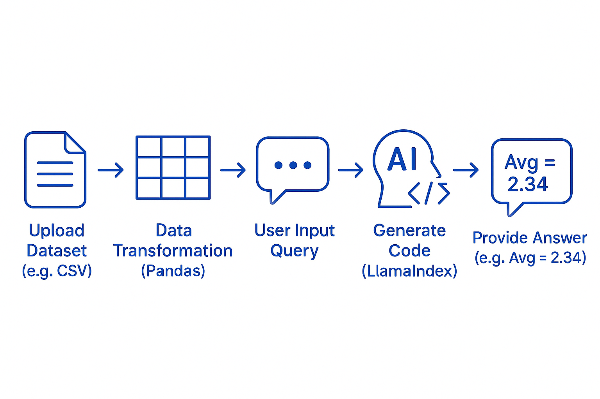

# DataSage

## Overview

**DataSage** is a powerful data analysis application that leverages AI to provide insights from your data. With a user-friendly Streamlit interface and integration with advanced language models, DataSage allows you to ask natural language questions about your datasets and receive meaningful answers.

---

## Features

- **AI-Powered Insights**: Analyze pandas DataFrames using natural language queries.
- **Streamlit Interface**: Intuitive and interactive UI for seamless user experience.
- **Dynamic File Selection**: Easily select and load datasets from your local directory.
- **Custom AI Agent**: Built with `AnalystAgent` for tailored data analysis tasks.

---

## Installation

1. Clone the repository:
   ```bash
   git clone https://github.com/your-repo/DataSage.git
   cd DataSage
   ```
2. Create a virtual environment and activate it:
    ```
   python -m venv .venv
    .venv\Scripts\activate  # On Windows
     ```
3. Install the required dependencies:
    ```
    pip install -r requirements.txt
    ```
4. Set up the configuration: Update the Config class in src/DataSage/config.py with your Ollama API details.

**Usage**
1.Run the application:
```
streamlit run app.py
```
2. Open the application in your browser (usually at http://localhost:8501).

3. Use the file selector to choose a dataset.

4. Enter a query in the input box (e.g., "What is the city with the highest population?").

5. View the AI-generated insights in the response section.


**Docker Support**
You can also run the application using Docker:
1. Build the Docker image:
```
docker build -t datasage-app .
```
2. Run the Docker container:
```
docker run -p 8501:8501 datasage-app
```
3. Access the application at http://localhost:8501.


